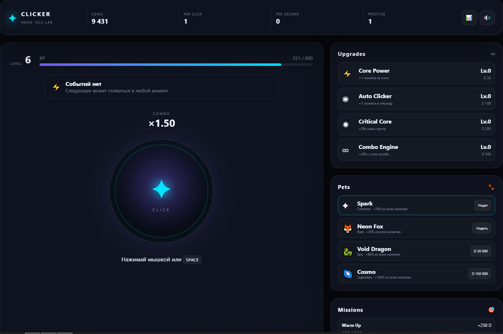
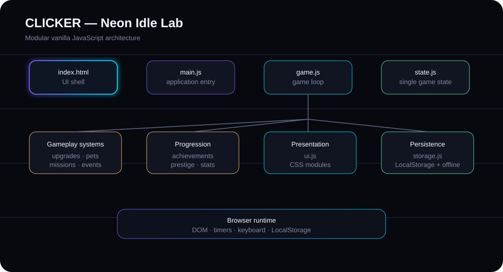

# ✦ CLICKER — Neon Idle Game

<p align="center"><strong>A polished browser clicker / idle game built with vanilla HTML, CSS and JavaScript.</strong></p>

<p align="center"><a href="https://milesden.github.io/clicker-game/"><strong>🎮 PLAY DEMO</strong></a></p>

<p align="center">
  
  
  
  
  
</p>

## About

CLICKER is a neon-themed incremental game focused on progression, automation and replayability. It uses modular vanilla JavaScript with no framework or build step.

## Features

- Manual clicking and SPACE input
- Upgrades and passive income
- Combo and critical clicks
- XP and level progression
- Random events
- Missions and achievements
- Pets with rarity and passive bonuses
- Prestige with permanent progression
- Statistics dashboard
- Offline earnings
- LocalStorage save system
- Responsive neon UI

## Preview

<p align="center">
  
</p>

## Architecture

<p align="center">
  
</p>

## Project structure

```text
clicker-game/
├── .github/workflows/pages.yml
├── assets/
│   ├── architecture.svg
│   └── screenshots/
│       └── gameplay.png
├── css/
├── js/
├── .gitignore
├── .nojekyll
├── LICENSE
├── README.md
├── START.bat
└── index.html
```

## Technical highlights

- ES modules for separation of concerns
- Centralized game state
- Modular gameplay systems
- Persistent browser storage
- Offline progression calculation
- GitHub Actions deployment
- No external runtime dependencies

## Run locally

1. Install Python 3.
2. Run `START.bat`.
3. Open `http://localhost:8000`.

Opening `index.html` directly with `file://` is not recommended because browser ES modules can be blocked by local-file security rules.

## GitHub Pages

The project is deployed automatically through GitHub Actions:

**Live demo:** https://milesden.github.io/clicker-game/

## Roadmap

- More upgrades and pets
- Daily rewards
- Leaderboard backend
- Sound effects and music
- PWA support

## Portfolio

This project demonstrates modular JavaScript, state management, browser persistence, UI architecture and deployment automation in a framework-free project.

## License

MIT
